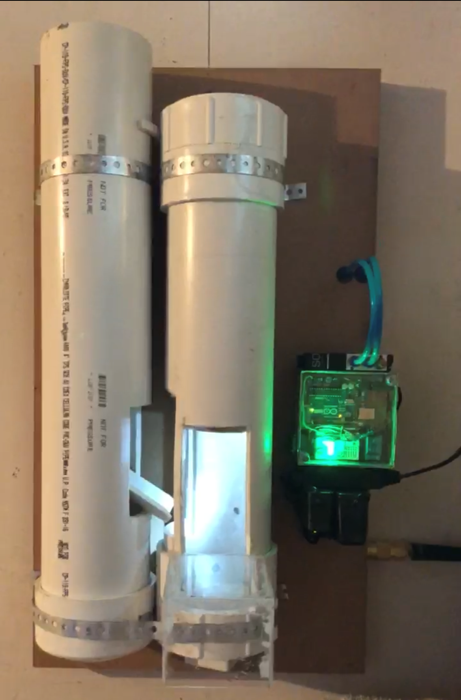
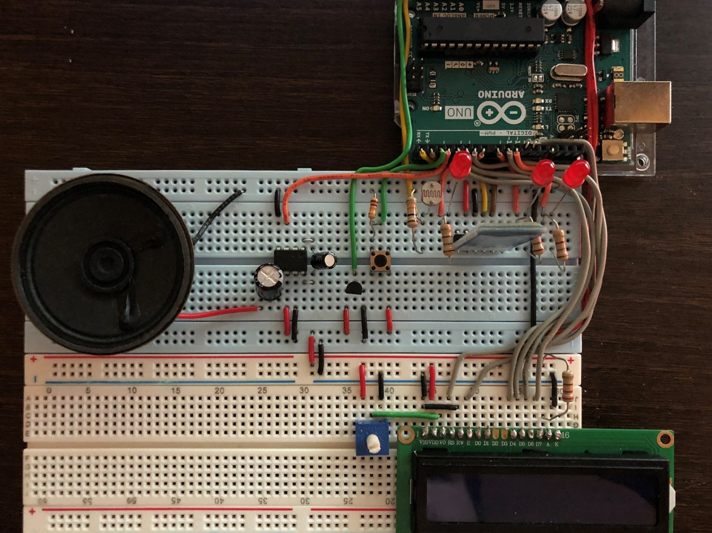

# Arduino
Here are some of the Arduino based projects that I've completed. Below is a brief description of the sub-folders. To navigate to them you can click each sections header or the sub-folders above. More information will be included in each sub-folder if necessary.

---

### [Can Crusher](./Can_Crusher/)

This is my favorite personal project I've worked on. Oddly enough there wasn’t much coding involved. It was a summer project inspired by the sudden influx of "driveway drinkers" during the lockdown period of Covid. My Dad's buddies were frequently at my home during the lockdown having get together outside in our driveway. It was a place for them to hang out even if all the restaurants and bars were closed. I was tasked with cleaning up after them and had an interesting idea, if I could motivate them to throw their own cans away, while simultaneously reducing the space each can takes up in a garbage can, I would have to do much less cleaning.

Thus, the Can Crusher was born. My idea was to create a contraption that the old men could throw their cans into, that would then feed those cans into a crusher chamber, automatically crush the can, and then spit the crushed can into a bucket. I figured this would entertain their technology detached brains just enough to avoid having to baby sit them. I went through many design iterations and ended up building one prototype that worked very well. It used an Arduino Uno for the brains, a light sensor to detect cans, a compressed air piston as the crusher, and a couple relays to control a solenoid valve. 

It's not the prettiest devise on the planet but it was the first time I'd engineered something from start to finish. It's still one of my fondest summers and even though the code is not complex, and the idea is simple, it remains by favorite project. I've linked a [video](https://youtube.com/shorts/ebb4qq3fnJ4?feature=share) below of the Can Crusher in action.

(Click image above to watch video!)

---

### [Real-Time Systems](./Real-Time%20Systems)

This section includes all projects from my Advanced Real-Time Systems class. RTS was an interesting class based on the FreeRTOS real-time operating system. Most of the class focused on the scheduling of tasks in an OS and the different methods to do so. For example, RM and DM scheduling are accurately modeled in one of the projects, and tasks are simulated using an Arduino file. FreeRTOS has a library usable in Arduino and gives greater system-level control over applications running on Arduino compatible microcontrollers (in our case an Arduino Mega). 

There are 3 sub-folders detailed in this section. For more information on each click the section header.

---

### [Smart Home](./SmartHome)

The Smart Home project was a simple Bluetooth based Android application using Arduino that I worked on with a friend. The purpose of this project was to become more familiar with breadboard wiring, Bluetooth modules, LCD displays and Android applications. This project helped me develop the [Can Crusher](#can-crusher) later on and gave me an understanding of Android apps and how to use Bluetooth modules with an Arduino microcontroller. I've attached some images of the system below.

