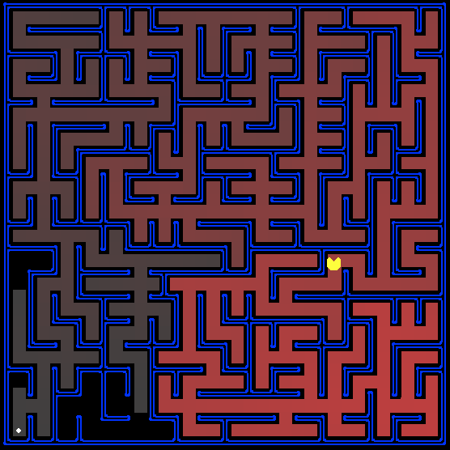

# Project 1

This was the first true project of the course and dealt with AI search algorithms. It explored Depth First Search, Breadth First Search, Uniform Cost Search, and A* Search. Using each of these methods, a PacMan-like avatar was tasked with finding the solutions to various mazes. Using the provided AI structure, individual search functions were written in order to ensure the correct answer on different size and complexity mazes. The search algorithms were analyzed for their efficiency and correctness.

An example of one such maze and the found correct path can be seen below.

All relevent files are in [search](./search/).

### Access `index.html` [HERE](https://htmlpreview.github.io/?https://github.com/joe-arbo/joe-arbo/blob/main/Artificial%20Intelligence/p1/index.html)