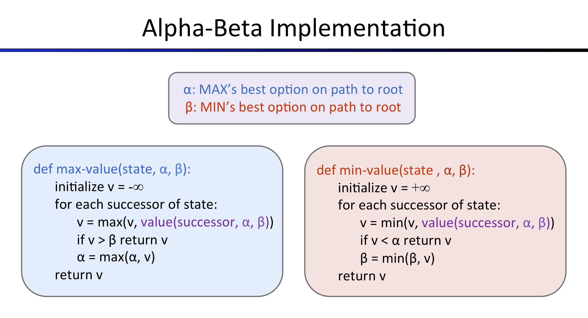

# Project 2

Project 2 focused on Multi-Agent Searches and various evaluation methods like MiniMax and Q-Learning. Functions of the provided AI structure were modified to implement multi-agent AI learning including ghosts as enemies. An example of a play board for this can be seen below.

The code was then adapted to allow the multi-agent structure to be simulated using a variety of evaluation techniques. There are individual functions for MiniMax, ExpectiMax, and Alpha-Beta Pruning. An example of an Alpha-Beta Pruning implementation diagram can be seen below.

All relevent files are in [multiagent](./multiagent/).

### Access `index.html` [HERE](https://htmlpreview.github.io/?https://github.com/joe-arbo/joe-arbo/blob/main/Artificial%20Intelligence/p2/index.html)