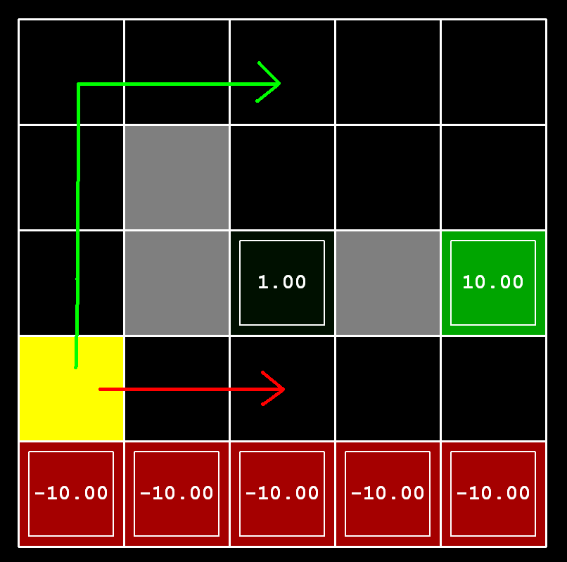
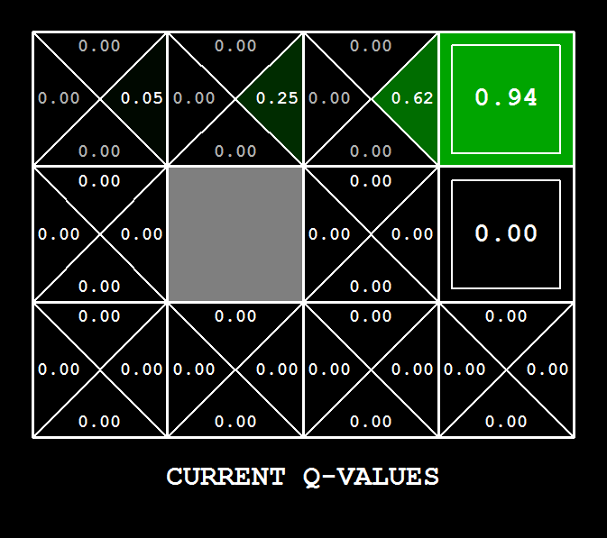

# Project 3

Project 3 focused on different types of AI reinforcement policies like value iteration and Q-learning. Examples of each of the policies represented graphically are labeled and included below. The squares represent possible moves on a game board and each policy weights choices differently. When these are applied to the PacMan avatar, its behavior changes according to what its current policy deems the best choice.

#### Value Iteration

#### Value Iteration applied to Bridge

#### Discount Policy

#### Q-Learning

#### Applied to Game Board

All relevent files are in [reinforcement](./reinforcement/).

Access `index.html` [HERE](https://htmlpreview.github.io/?https://github.com/joe-arbo/joe-arbo/blob/main/Artificial%20Intelligence/p3/index.html)