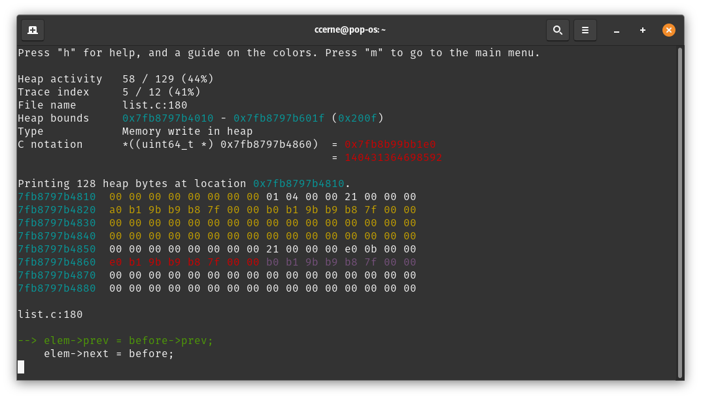
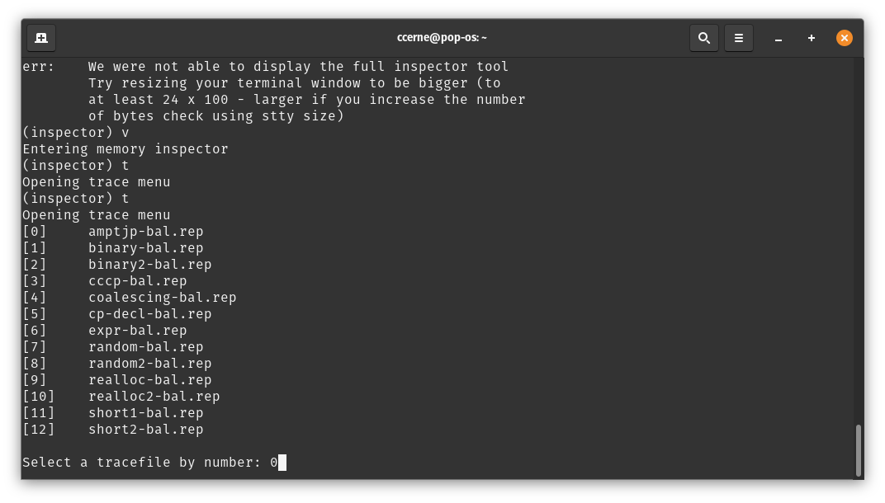
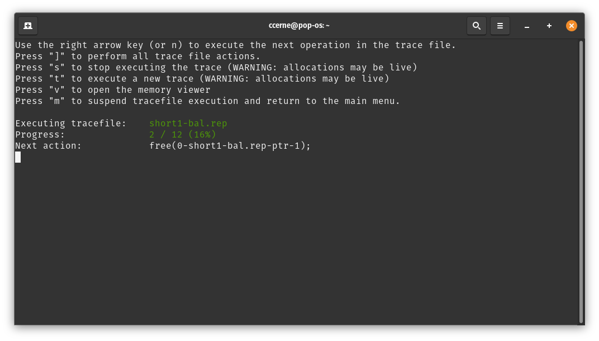

# Heap Inspector

The specification for Project 3 is on the course website. This README describes the specification for a brand new tool that can aid in the development of the malloclab project.

## Motivation
The heap inspector is a tool written in Python, C++, and C to catch common errors in execution right as they happen.

To instrument errors, the heap inspector uses the [LLVM compiler infrastructure](https://llvm.org/) to analyze the student code and detect memory writes. This is done by looking for instructions that cause memory writes (i.e. store instructions) and then injecting a function call to the heap inspector to dynamically instrument the code at runtime. Using this information, in conjunction with information from memlib, the tool can reliably detect invalid memory writes before they occur.

The tool can also detect writes to payload regions, corrupted linked list pointers, unaligned pointers, and overlapped payload regions.

This tool also has the great advantage of helping students visualize memory writes in the heap right as they happen, to better understand what the heap looks like, and how the common malloclab errors manifest themselves. The memory viewing tool within the heap inspector allows students to memory writes happen in real time and view past memory writes.


## Getting Started
Assuming ``~cs3214/bin`` is in your ``$PATH`` (which you should've done for the earlier projects), running the tool is as simple as running ``heapinspector.sh`` in the directory containing your ``mm.c`` file. There are some command line options you should be aware of.

Various flags can be passed to the heap inspector. These are as follows:

### ``-s``, ``--same-heap``
When specifying this option, ``mmap`` will be used internally to create the initial heap. This has the advantage of consistency, because heap addresses will not be randomized.

When specified, ``mem_init(1)`` will be called in the ``memlib.c`` file. This will start the heap at ``0x58000000``. Otherwise, ``mem_init(0)`` will be called which will randomize the heap addresses.

### ``-d``, ``--disable-free``
Disable the check for integrity of free lists. This may make the program run significantly faster, but has the disadvantage of not being able to catch free list corruptions as they happen.

Because free lists are commonly linked lists, checking each free list is an ``O(n)`` operation.

### ``-r``, ``--rebuild``
Force a rebuild of the malloclab project. By default, the project will only run ``make``, but this will also run ``make clean``.

### ``-b BYTES``, ``--bytes BYTES``
Specify the amount of heap bytes to display in the inspector tool. By default, this is set to 128, but specifying this option will set it to BYTES.

Note: your terminal window must be large enough to display extra bytes. The default option of 128 requires the terminal window to be at least 24 rows and 100 columns. This information can be obtained by running ``stty size``.

## Heap Inspector REPL
REPL stands for "read-eval-print-loop". When launching the ``heapinspector.sh`` file with any arguments you may want, you will be greeted with a prompt that you can type various commands into. Essentially, you can think of it as a command line interface.

This is the main entry point for the heap inspector. Additionally, when the heap inspector detects an impending crash, the REPL will open in safe mode, allowing students to continue debugging their heap implementation without the risk of their program crashing.

When the heap inspector is in the aforementioned safe mode, students will not be able to have access to all of the commands that they normally would. For instance, they will not be able to make new allocations on the stack, free memory, etc. This is to prevent the malloclab implementation from entering an invalid execution state (because any further changes to the heap could lead to more errors derived from the first one). To see which commands are available in safe mode, run ``help``in safe mode.

Commands can be entered by their first letter to save time. These commands are as follows:

### ``help``
Open the help menu. The output of this menu will be dependent on the state of the heap viewing tool. If the heap viewing tool is in safe mode, the help menu will only output the appropriate safe mode commands.

### ``allocate POINTER SIZE``
Allocates ``SIZE`` bytes and associates the memory address with ``POINTER``. Think of ``POINTER`` as the human-readable "variable" representation of the address returned from a successful call to ``mm_malloc``.

``POINTER`` is a an alphanumeric string (which can also include hyphens and underscores).

Example: ``allocate 1 1024`` or ``a 1 1024``

### ``free POINTER``

Free the memory associated with ``POINTER``.

``POINTER`` is a an alphanumeric string (which can also include hyphens and underscores). Currently, the heap inspector does not support specifying the pointer value instead of the alphanumeric string.

Example: ``free 1`` or ``f 1``

### ``reallocate POINTER SIZE``
Reallocates ``SIZE`` bytes and associates the memory address with ``POINTER``. Think of ``POINTER`` as the human-readable "variable" representation of the address returned from a successful call to ``mm_realloc``.

``POINTER`` is a an alphanumeric string (which can also include hyphens and underscores).

Example: ``reallocate abc 1024`` or ``r abc 1024``

### ``new``
Reset the malloclab. Internally, this calls ``mem_init`` and resets the heap state to what it was when the program first started.

Please note that this is not automatically done when a new tracefile is executed.

### ``trace``
Execute a trace file. This will open up a dialog to select a trace file. Students can even choose to create their own trace files in their ``traces`` directory which will appear in the input.

When executing a trace file, the student can use keyboard controls to navigate through each trace. They can also exit the trace file, execute other tasks in the inspector, and come back to the trace. More documentation on this functionality can be found later in this README.

### ``dump``, ``dump LIST``
Executing ``dump`` without any arguments will simply dump information about the free lists, including where they are located in memory, the symbol associated with the free list, and how many elements are contained within them.

The symbols for the free lists are pulled from the output of ``nm`` (see: ex2).

When specifying an argument here (where ``LIST`` is the list number, as displayed in the leftmost column of the free list dump), pointers to each ``list_elem`` that are in this linked list will be displayed. Unfortunately, this is the only useful information that can be extrapolated (because the structure of free blocks are implementation dependent).

### ``live``
This will print a list of all of the live allocations at this point in execution, including the human-readable representation of that pointer, the memory address, and the size.

### ``bounds``
Prints the current heap bounds at this point in execution.

### ``gdb``
This will execute ``gdb``. Because the malloc library is compiled with debugging symbols, students can easily 

Note: this mode is most useful when the heap inspector encounters a situation in which the program may crash, so that the user can look at information regarding the execution leading up to the crash.

### ``view``
This will open up the memory viewing tool. An in-depth description on this tool is later in the next section.

### ``quit``
Quit the memory inspector. This exits the debugging session.

## Memory Viewer
The memory viewer tool is an intuitive interface that allows students to quickly and easily step through changes in their heap implementation. This tool can be accessed by entering the ``view`` command in the main REPL loop.

As mentioned, the heap inspector will instrument the student's malloclab implementation and identify every memory write to the heap. This information is not only used to identify invalid writes and free list corruptions, but can allow the capability of stepping forward and backwards in different heap actions and view the memory at specific addresses.

While executing the memory viewer, the student can access a help menu (by pressing ``h``) to learn how the memory viewer works.

Here are some keyboard controls.
```
left, right, n, space	Step to the next or previous heap activity
[, ]			Jump to the beginning or end of the heap activity
up, down		Change the heap memory location
page up, page down	Jump to the beginning or end of the heap memory location
j			Jump to the current pointer
t			Open trace file menu
```
Here is what the different coloring indicates in this tool:
```
Cyan			Addresses of the bytes printed in the heap viewer
Red			Bytes being written to the heap at this action
Magenta			Detected pointer (note: may be encapsulated inside malloc'd region)
Yellow			Region of allocated bytes
```

### What Are Heap Activities?
A heap activity is an internal name used by the heap inspector tool to distinguish different actions taken by the heap. These will all be viewable from within the memory viewer tool. There are a few different types of heap activities.

#### Heap Snapshot
When you first execute the tool, you may notice a "blank" action. This is a heap snapshot. Internally, the tool saves a snapshot of the current heap so that it can save time while reconstructing it later in execution.

Technically, these heap snapshots have no bearing on the execution of your code and you can safely ignore them.

These heap snapshots are taken at a set interval.


#### Function Calls and Function Returns
One category of heap activities is the start of a function call (with the applicable arguments) and the end to a function call (with any applicable return value).


Notice how the second screenshot has the payload region colored in yellow.

#### Memory Write in Heap
This heap activity is simply describing a memory write in the heap. When looking at the heap viewer, look out for red text highlighting the value being written in the heap.

Here's an example of this in action. In the screenshot below, there are a few interesting things to note. First, consider all of the yellow regions. These are regions currently allocated. Also notice the magenta / purple coloring. The values highlighted in magenta are detected to be intra-heap pointers.



### About Jump (``j``)
The ``j`` command simply takes the user to the pointer described by the current heap activity (if applicable). For instance, on a successful return from ``mm_malloc``, the user can press ``j`` to jump their cursor to wherever the current memory write is.

## Trace Executor
The trace executor tool (which can be launched using the ``trace`` command in the main REPL) is used to execute a trace file.



After selecting a trace, you will be greeted with a menu to advance the trace. You should be able to simply advance the trace using the right arrow key, ``n``, or the space key.

You can also jump right into the memory viewing tool for convenience without going to the main menu.



## State Diagram
Recall that there are three main states that the heap inspector can be in. It can either be in the main REPL interface, the memory viewer, or the trace file executor.

For convenience, we've added seamless transitions between all of these tools. From the main menu, the memory viewer can be accessed with ``view`` and the trace executor can be accessed with ``trace``.

From the memory viewer, you can access the trace file executor with ``t`` and the main menu with ``m``.

From the trace executor, you can access the memory viewer with ``v`` and the main menu with ``m``.

