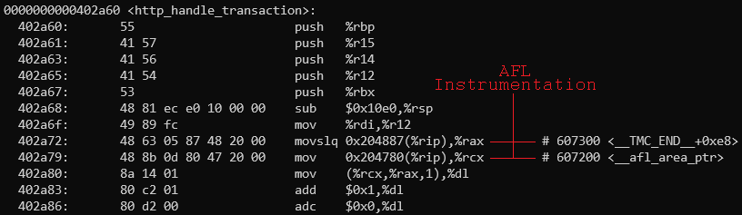

# Concepts: What is AFL++?

AFL++ is a **fuzzer**: a program specifically designed to craft crash-inducing inputs and feed them to a target program (your server). It's actually an upgraded, supercharged spinoff of AFL. (AFL is short for "American Fuzzy Lop") The original AFL was developed by [Michał "lcamtuf" Zalewski](https://lcamtuf.coredump.cx/), a Polish white-hat hacker and security expert.

*   **AFL++**: [Website](https://aflplus.plus/)
*   **AFL++**: [GitHub Repository](https://github.com/AFLplusplus/AFLplusplus)
*   **AFL**: [Website](https://lcamtuf.coredump.cx/afl/)
*   **AFL**: [GitHub Repository](https://github.com/google/AFL)

(For the sake of this explanation, we'll refer to both AFL++ and AFL as just "AFL".)

## Source-Code Instrumentation

AFL is a fuzzer designed specifically for C programs. With a special compiler, it instruments the target program at compile-time with small blocks of assembly. This assembly acts as a series of indicators to help AFL understand how the program behaves when executed with a certain input.


  
This instrumentation accesses a shared memory space between the target program and AFL used to count the executions of basic blocks. A **basic block** is a straight-line code sequence with a single entry point and single exit point. (In assembly, this is a chunk of code no branch instructions, save the entry and exit branches. In C, you can roughly think of these as small chunks of code inside if-statements, for-loops, and other control structures.)
  
Thanks to this, AFL is able to determine exactly how the target program behaves when supplied with a certain input, down to each control structure the programmer wrote.

## Input Generation

Many "blind" fuzzers (those that _don't_ benefit from source-code instrumentation) generate random inputs to send to a target program. While this can have some success, it largely depends on the luck of the draw. AFL isn't blind: it is able to learn from the instrumented binary by watching which inputs create new behaviors. Armed with this, it recycles old "interesting" inputs and further mutates them to narrow down specific problems in the target program.
  
In order to do this, there's one caveat: AFL needs an "input corpus" - that is, a set of files that depict typical input for the target program. For example: if we were fuzzing a program that reads in two numbers from STDIN, we might provide these "typical inputs" to AFL:

```
2 3
```

```
-7 12
```

```
506 2323
```

New "interesting" inputs (inputs that create new behavior in the target program) are stored in a queue, from/to which AFL pulls/pushes while fuzzing.

### Fuzzing the Target

Once started, AFL runs indefinitely, unless specified otherwise. As it runs, it executes the target program several times per second, supplying an unique input and watching how it reacts. If a crash or timeout occurs, the input that caused the issue is stored in a separate location as part of the fuzzer's output.
  
While it's running, the user is presented with a neat status screen that depicts the fuzzer's progress. You can watch this to see the AFL's progress:


  
AFL works by repeatedly spawning a child process to execute the target program, then waiting for the child process to terminate. If AFL sees that the child process exited by receiving a deadly signal, it flags it as a crash. If AFL sees the child process didn't exit after a certain amount of time, it flags it as a hang.


  
Once fuzzing has completed, the user can view the crash-inducing and hang-inducing input files AFL found. They can be used to recreate (and hopefully fix!) the discovered bugs.