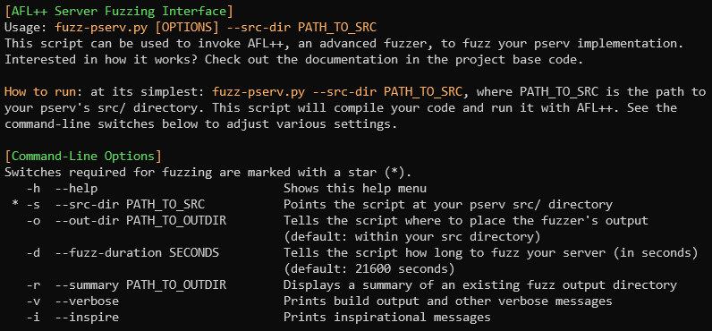
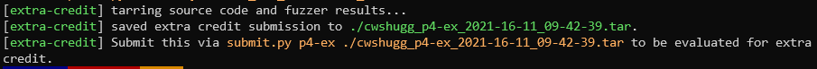

# How do I fuzz my server? (`fuzz-pserv.py`)

Fuzzing your server can be done using the `fuzz-pserv.py` python script, located in the CS 3214 bin folder on RLogin (`/home/courses/cs3214/bin/fuzz-pserv.py`). To get started, simply run `fuzz-pserv.py` - you'll be presented with a help menu:

  
Fuzzing your server is as simple as typing `fuzz-pserv.py --src-dir <your_src_dir>`. The script will compile your code with AFL++'s compiler, perform a small test run, then launch AFL++. You'll be presented with the AFL++ status screen. You can choose to either wait until the fuzzer times out (this time varies - see below), or you can use Ctrl-C to terminate it.
  
To understand everything displayed on the status screen, check out [AFL++'s documentation](https://aflplus.plus/docs/status_screen/). You'll probably be most interested in the "overall results" section of the status screen, displayed in the top-right corner. This gives a report of all unique crashes and hangs, as well as how many "paths" the fuzzer has discovered. (A "path" describes a unique path of code executed by your server. A "unique" crash/hang describes a crash/hang that was found on one such path.)

## Research Participation

When the fuzzing script starts, you'll be presented with a brief menu asking about research participation. This project is part of Connor Shugg's M.S. Thesis project work. If you choose to grant consent, your source code and fuzzer results will be collected and stored in a secure location for research purposes. Before making a decision, please read the forum post and full consent form displayed on the course forum and course website.

## Fuzzing Results

Once AFL++ has terminated, (either when finding a bug or after a set timeout) the script will print a summary of the crashes/hangs that were found. By default, the output directory will be placed in your pserv's src directory (specified by `--src-dir`). However, you can use the `--out-dir` switch to specify otherwise.

If crashes or hangs are found, the directories containing the crash-inducing input files are listed in the summary. Two shell scripts will be generated and placed within the output directory. Simply give those a run to reproduce the crashes and get debugging!

## Extra Credit

Once fuzzing has finished and the fuzzing summary has been printed, you might notice a message regarding extra credit being printed:

Using this fuzzer allows you the chance to earn extra credit on project 4. This extra credit scores you for how well your server performed under fuzzing for certain time periods. A `.tar` file is produced after each fuzzing run and is submittable to a special `p4-ex` grading endpoint for extra credit evaluation.
