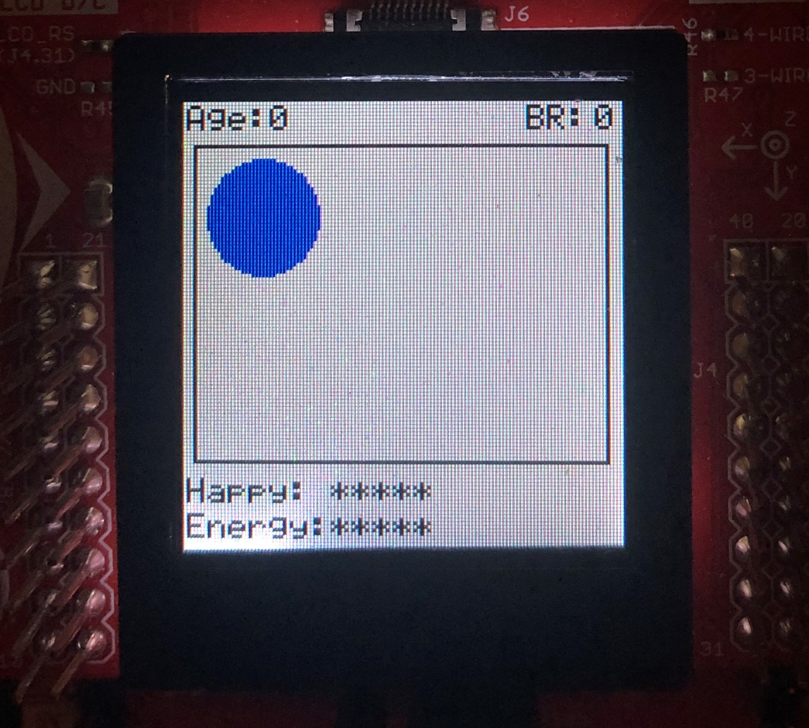
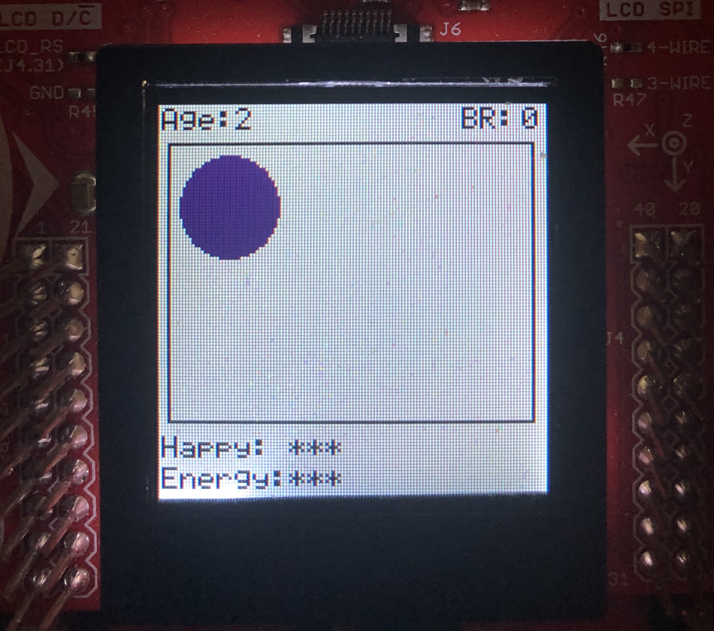
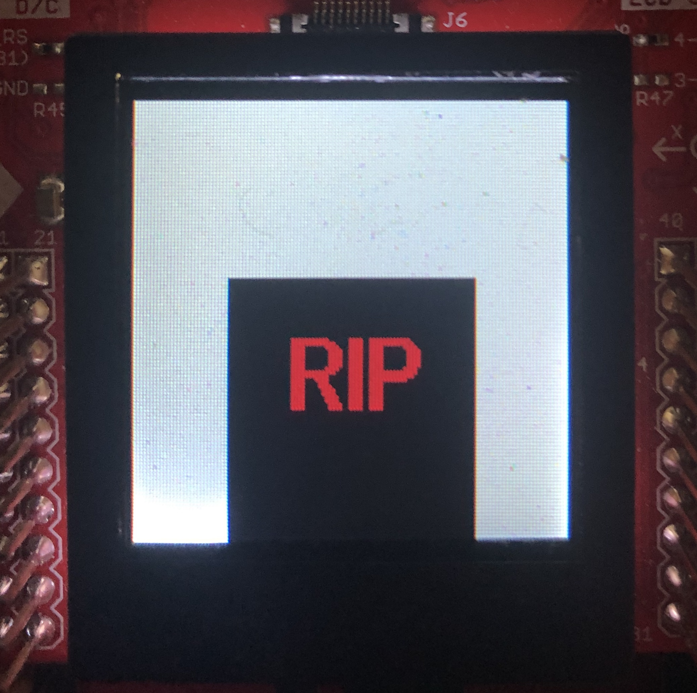

# Project 2

Project 2 focused on a Hardware Abstraction Layer interacting with the BoosterPack. We were tasked with created a Tamagotchi like program that would allow for the user to hatch, feed, and play with an in-game pet. The goal of the project was to effectively design an HAL to interface with the board and then display the contents of the game on the BoosterPack screen. The HAL implementation is in the `HAL` sub-folder and an example of the game states can be seen below.

  