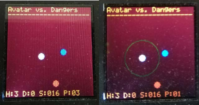

# Project 3

Project 3 expands on the concepts learned in [Project 2](../project2/). This time, we were tasked with created a game that uses the joysticks and buttons on the BoosterPack. The game used the same HAL from previous projects. The game was a fighter-based game in which the user could attack and defend against opponents. The game is simple but interfacing with the hardware directly to make it work is what the project was really trying to teach. Example images can be seen below.

