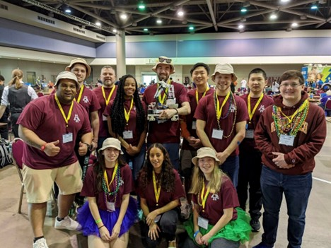
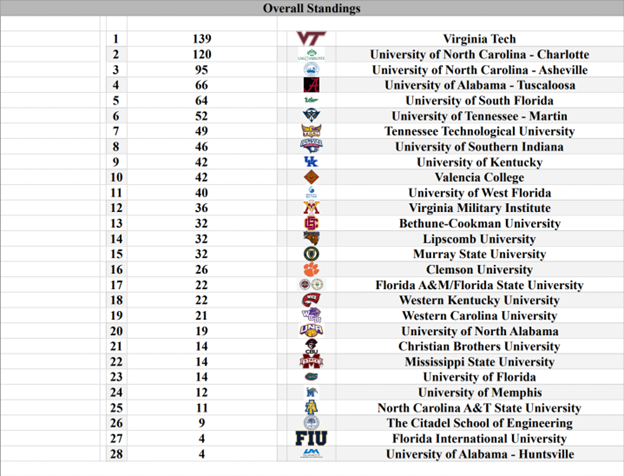
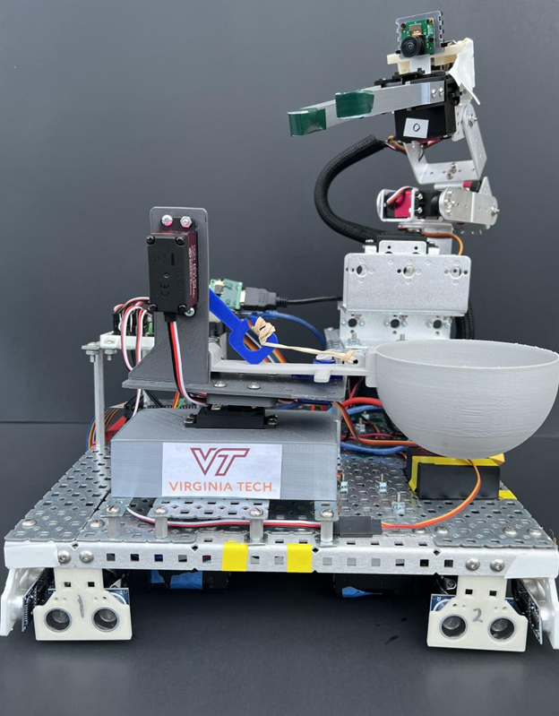
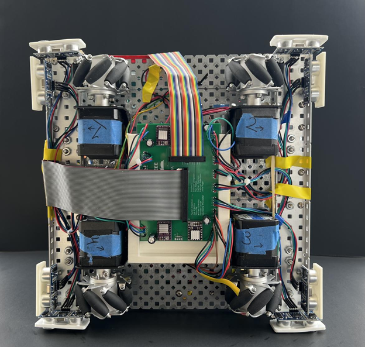
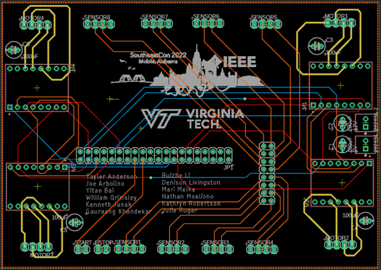

# IEEE Robotics 2022

This project’s requirements were to build a robot that could compete at IEEE Southeast Con 2022 in Mobile, Alabama. Each year IEEE holds a robotics competition during their conference and Virginia Tech usually participates.

The team was comprised of many sub-teams of which I was the leader of 2. I began as the arm team lead and worked to finalize the design and functionality of the arm sub-system. I also structured the code for the arm which would later be implemented into the final robot. I then moved to the navigation/sensor sub-team and was designated team lead upon my arrival. Here I worked to finalize the sensor code (PID system for active movement correction) and wrote code to allow the wheels/motors to communicate with the sensors.

Team Pic (the hats were from a local restaurant showing us support): 

This project was a huge success! We ended up placing 1st out of 28 teams in attendance. Here are the rankings:

---

### Technical Details

The robots main goal was to navigate and complete tasks on a game board designed by IEEE. The robot we designed used a 5 degree of freedom arm with a camera mounted on it. The camera was trained via TensorFlow and OpenCL (two modern Computer Vision tools) to be able to recognize objects on the game board. The robot also utilized a clever catapult design to launch objects during the run-time of the course. It was required that the robot be able to pick up and throw objects of interest (found by the camera) into various nets (also found by the camera). All these sub-systems were run on an Arduino and Raspberry Pi. A picture of the front of the robot has been included below.

To move the robot, we used for Mecanum Wheels, which allowed for omni-directional movement. The robot was battery powered and used motor controllers to drives the wheels. The electronics were all controlled by a custom PCB designed and printed by the team. A picture of the bottom of the robot and the PCB design can be see below.

 