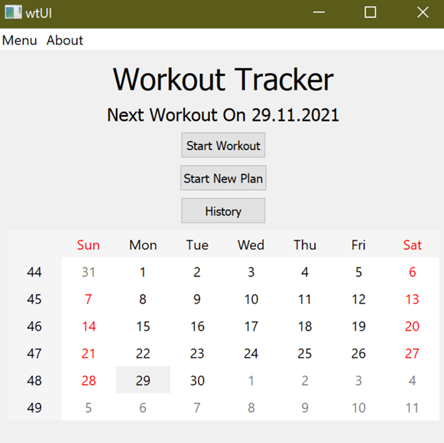
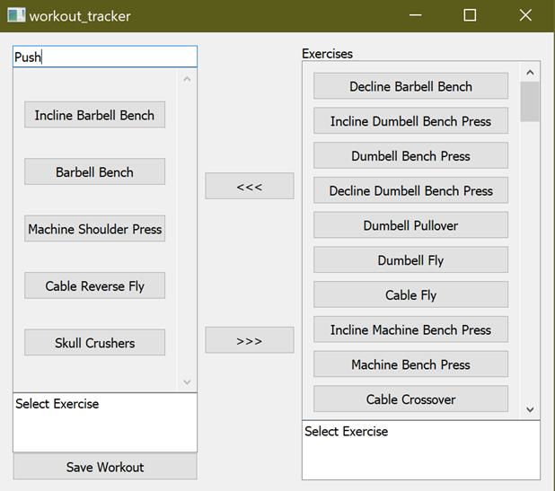

# Large Scale Sofware Development

This class was more about concepts then actual coding, but I wanted to include it here because it taught me many valuable coding methodologies that are utilized in the industry. These ranged from individual coding techniques (e.g., Singleton, State Machines), to developmental practices (e.g., Scrum, Waterfall). This section only consists of one project that implemented the methods learned during the course. Most importantly, we used Scrum to manage our team workflow, allowing me to become familiar with the most common developmental management system. 

The project itself is not very complex and was coded in C++ and implemented with Qt. It’s a GUI based workout scheduling app that was only completed to get the class familiar with Scrum. As with other classes this project was completed as a group but many of the files were at least modified by me if not coded in their entirety. Below you can see some examples of the GUI.

