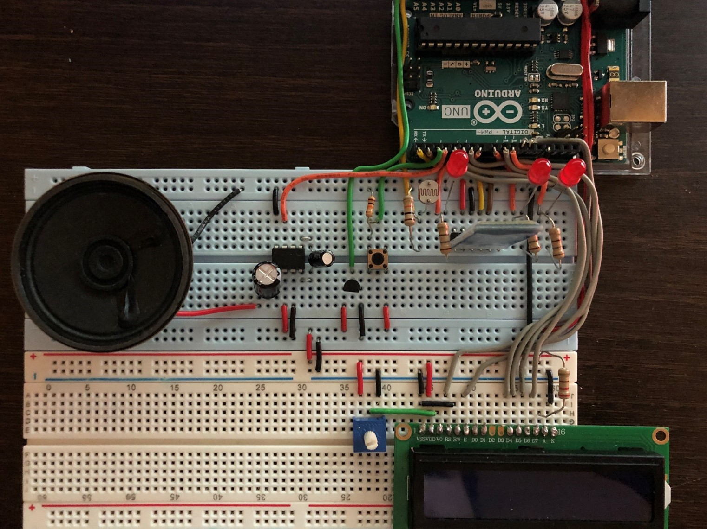

# Hi there 👋, I'm Joe

### Thanks for stopping in!

This is a collection of all the projects and exercises I've completed or collaborated on. I have tried to make this GitHub as user-friendly as possible and have included as many explanations, pictures, examples, and directions for execution as I could. Most of these projects were completed during my time at college and therefore, they include many files needed for the execution of the programs, but that I didn't write myself. These files were all interfaced with during the completion of the projects so I do understand how all the code works and what its purpose is, but it would be wrong of me to pass these particualar files on as my own work. 

You might have noticed that GitHub reports the language variance to be ~70% Python. This is also a consequence of the extraneous files I mentioned above. Most of the supporting files provided for us were written in Python, so the actual split between the languages I actively practice is more even. Below is a table of contents (of a sort) giving an overview of what each folder in this repository contains. There will be more information provided in each folder. If you have any questions, please do not hesitate to contact me with the details found in the [Contact Information](#contact-information) section.

If you are seeing this on my Profile page, you can navigate to the main repository by clicking [HERE](https://github.com/joe-arbo/joe-arbo), otherwise you can navigate to the individual folders described below by clicking on their header.

---

### [Arduino](./Arduino)

Includes two personal projects and all projects from my Advanced Real-Time Systems class. RTS was an interesting class based on the FreeRTOS real-time operating system. Most of the class focused on the scheduling of tasks in an OS and the different methods to do so. For example, RM and DM scheduling are accurately modeled in one of the projects, and tasks are simulated using an Arduino file. FreeRTOS has a library usable in Arduino and gives greater system-level control over applications running on Arduino compatible microcontrollers (in our case an Arduino Mega). 

As for the personal projects, my favorite is included in this section. It was inspired by the COVID closures and my Dad's drinking buddies now deciding their new "watering hole" would be my driveway. It's not the most complex project, but it was the most fun I had designing something and it allowed me to step outside my comfort zone.

The other personal project was a simple bluetooth based Android application using Arduino that I worked on with a friend. The purpose of this project was to become more familiar with breadboard wiring, bluetooth modules, LCD displays and Android applications. The file included here is only the Arduino portion of the project. None of this was intended for deployable use. You can see some examples of this project below.

---

### [Artificial Intelligence](./Artificial%20Intelligence)

This class was adapted from a course at UC Berkeley and used by the Virginia Tech CS department. As a result, most files are accredited to individuals belonging to UC Berkeley. The class explores common AI principles from simple search algorithms, to Q-learning, to Inference Observation. I completed 5 main projects here that use a Pac-Man-like game interface to demonstrate these core concepts. 

Each project is housed inside its own folder and has an `index.html` file explaining how to run the tests and what was required for each project. There is also a README in each project folder explaining briefly what the project entailed and what concepts it taught, as well as pictures of what each program's GUI looks like at run-time to demonstrate their functionality.  

Here are some run-time GUI examples (Iteration and Inference respectively):

---

### [Computer Systems](./Computer%20Systems)

This was one of the more difficult classes I took while getting my degree. Its purpose was to explore and demonstrate how an OS works under the hood using primarily C. The projects were difficult and taught concepts like process management, memory allocation, secure servers, and multithreaded workloads.

This section contains 4 major projects and some exercises completed in this class. All projects were completed with a partner who has been notified of their works' representation here. These projects are hard to demonstrate graphically so a README is included in each folder to explain either how to use the program or what the program does. Hopefully, this will make it easy to understand the concepts and C foundations I learned in this class.

This class provides many support files for the completion of its projects so not every file was developed by me or my partner. I have tried to properly document files that may have other contributors, but it is difficult to point out which parts in every file were edited by my partner and me. Because of this, I will state a disclaimer that even though most files were, at the very least, modified by my partner and me, I cannot guarantee that all work viewed belongs to us. All files are necessary for the execution of these programs so removing any of them is not an option, but if any questions arise as to the specifics of any files, please do not hesitate to reach out. ([Contact Information](#contact-information))

NOTE: This section has been removed.

---

### [Data Structures and Algorithms](./Data%20Structures%20and%20Algorithms)

The name of this course speaks for itself. It explores common data structures and sorting algorithms and how to utilize them in programming applications. This class covered external sorting using a Min-Heap and Merge Sort, key-value pair sorting using hash maps, and key-value pair sorting using a skip list and Quad-Tree. This class was partner based and all files were worked on by both my partner and me. The author of each file is listed in the JavaDocs of said file and only indicates the creator, it does not reflect work done.

This class was done entirely in Java, however, I did take another DSA course that was done in C++. That class explored similar topics such as linked lists, binary search algorithms/trees, Ray-Tracing, Deques, mini-max, and more. The projects completed for that class were much more in-depth than the Java class and I wish I could display them here. Unfortunately, the SSD those projects were stored on was corrupted before I had a chance to back them up. Because of this, the only projects located here are in Java. 

These projects are hard to show graphically and even harder to run while showing any intelligible information. They were also graded automatically so instead of directions for execution, I briefly describe what each project implements and which files are important.

---

### [Embedded Systems](./Embedded%20Systems)

The primary focus of my Embedded Systems course was to learn how to interface with the MSP432P401R LaunchPad microcontroller and its BoosterPack hardware module. There are 3 projects for this class, each building on the last. The first project focuses on learning how the MSP and BoosterPack communicate with one another, project two focuses on the GUI elements and the interaction between the microcontroller and UART keyboard inputs, and the third project focused on making a fully functional game using the BoosterPacks controls. 

This class was programmed in C and uses the MSPs ports (similar to Arduino) to write information to the BoosterPack. This made designing and programming a relatively simple game more challenging because it was no longer as simple as telling the screen what to display. These projects can't be simulated without the MSP so explanations and pictures of the BoosterPack display are included in each project folder. An example of the MSPs display can be seen below.

---

### [IEEE Robotics 2022](./IEEE%20Robotics%202022)

This project served as my senior capstone and as an opportunity to dive into the world of robotics, which prior to this, I had little experience with. The projects requirements were to build a robot that could compete at IEEE Southeast Con 2022 in Mobile, Alabama. Each year IEEE holds a robotics competition during their conference and Virginia Tech usually participates. The team had a lot of creative freedom with this project, which made it a very enjoyable experience. 

The team was comprised of many sub-teams of which I was the leader of 2. I began as the arm team lead and worked to finalize the design and functionality of the arm sub-system. I also structured the code for the arm which would later be implemented into the final robot. I then moved to the navigation/sensor sub-team and was designated team lead upon my arrival. Here I worked to finalize the sensor code (PID system for active movement correction) and wrote code to allow the wheels/motors to communicate with the sensors.

This section is basically our team GitHub copied for my own personal records. I only added a new README and some pictures to demonstrate some of the robot functionality. This project was a huge success! We ended up placing 1st out of 28 teams in attendance. You can check out those rankings [HERE](https://github.com/joe-arbo/joe-arbo/blob/main/IEEE%20Robotics%202022/ranking.png) and a picture of the robot and the team below (the hats were from a local restaurant showing us support).

---

### [Large Scale Software Development](./Large%20Scale%20Software%20Development)

This class was more about concepts then actual coding, but I wanted to include it here because it taught me many valuable coding methodologies that are utilized in the industry. These ranged from individual coding techniques (e.g., Singleton, State Machines), to developmental practices (e.g., Scrum, Waterfall). This section only consists of one project that implemented the methods learned during the course. Most importantly, we used Scrum to manage our team workflow, allowing me to become familiar with the most common developmental management system. 

The project itself is not very complex and was coded in C++ and implemented with Qt. It’s a GUI based workout scheduling app that was only completed to get the class familiar with Scrum. As with other classes this project was completed as a group but many of the files were at least modified by me if not coded in their entirety. Below you can see some examples of the GUI.

---

### [Software Reverse Engineering](./Software%20Reverse%20Engineering)

Reverse engineering is a topic I have very little experience with. This course represents the extent of my knowledge, and while this is not something I plan to pursue as a career, I felt it important to mention the skills learned from it. We used the NSAs disassembler and decompiler `Ghidra` for most of this class and learned how to change binaries back into human readable code, how to reverse engineer and analyze malware, and how to find and exploit vulnerabilities in software.

Although difficult, I found this subject extremely interesting. I gained a much deeper understanding of how computers process executables, what binary files actually contain, and how to manipulate the tools we were provided to solve relatively complex problems hiding inside executable files. This class was a lot of fun and I really think I took a lot of good information away from it, even if it doesn't really pertain all that much to software engineering. 

The assignments in this section are hard to represent graphically, so I did my best to describe what the purpose of each was and what concepts were learned from them. There’s not much to this section but I wanted to document what I learned so I could come back to this and keep learning later.

---

### [Contact Information](#contact-information)

#### Joseph Arbolino
Virginia Tech 2022 
Bachelor’s: Computer Engineering 
Major: Software Systems 
Minor: Computer Science 

Email: joearbo13@vt.edu 
Cell: 973-590-1442

<!--
**joe-arbo/joe-arbo** is a ✨ _special_ ✨ repository because its `README.md` (this file) appears on your GitHub profile.

&hide=contribs,prs,stars

Here are some ideas to get you started:

- 🔭 I’m currently working on ...
- 🌱 I’m currently learning ...
- 👯 I’m looking to collaborate on ...
- 🤔 I’m looking for help with ...
- 💬 Ask me about ...
- 📫 How to reach me: ...
- 😄 Pronouns: ...
- ⚡ Fun fact: ...
-->
